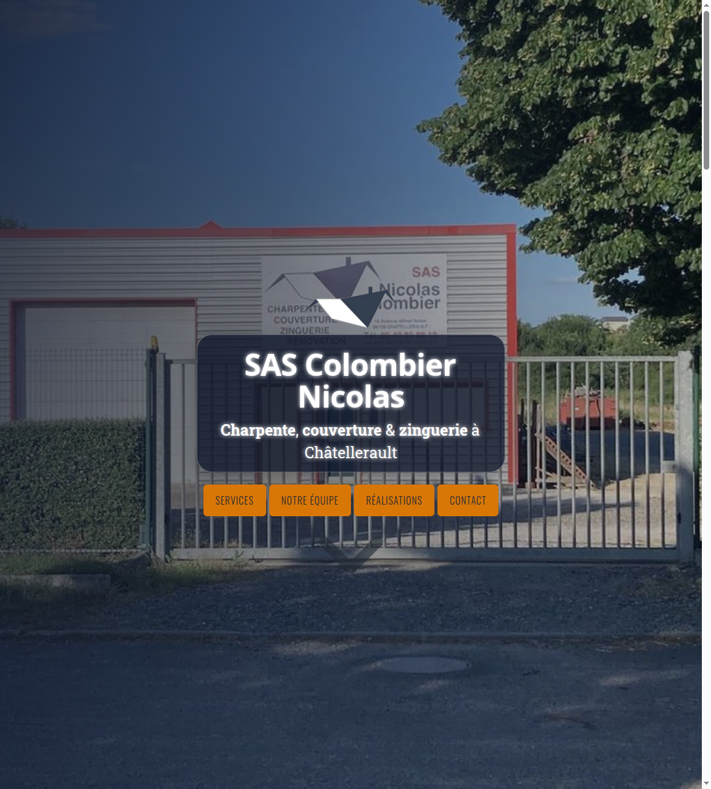
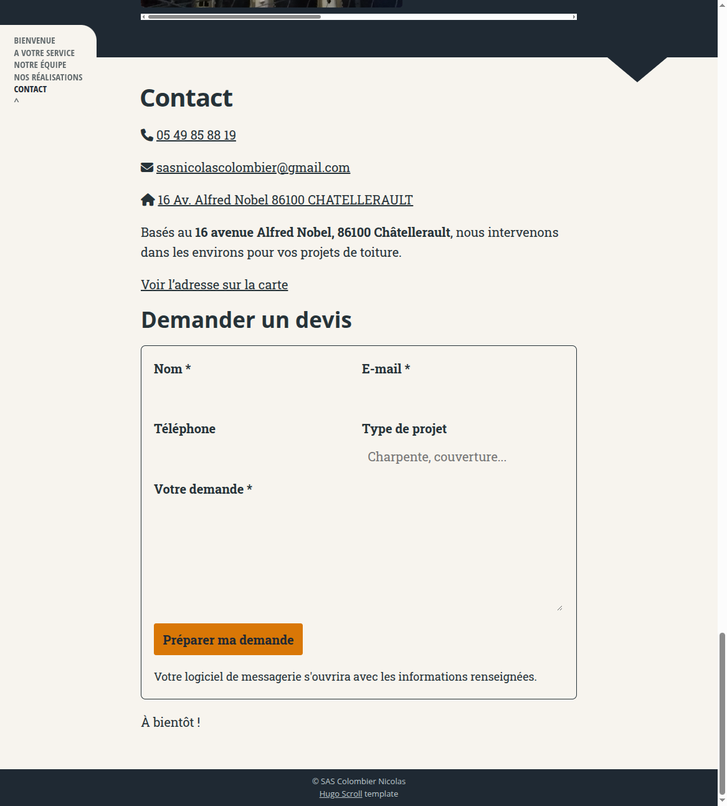

# SAS Colombier Nicolas

Site vitrine statique de **SAS Colombier Nicolas**, artisan en charpente, couverture et zinguerie à Châtellerault.

**Production :** [gjoyeux.github.io/colombier](https://gjoyeux.github.io/colombier/)

## Aperçu





## Stack technique

- [Hugo Extended](https://gohugo.io/) `0.141.0` : génération statique.
- [Hugo Scroll](https://themes.gohugo.io/themes/hugo-scroll/) : thème de base personnalisé.
- Markdown et templates Go : contenu et composants.
- SCSS : variables et styles de marque.
- SVG, JPEG et WebP : images locales et optimisées.
- GitHub Actions + GitHub Pages : build et publication actuels.

Le site ne dépend d'aucun framework JavaScript applicatif ni d'un backend. Le formulaire de contact statique prépare un e-mail via `mailto:`.

## Développement local

### Prérequis

Installer Hugo Extended `0.141.0` et Git, puis initialiser le thème :

```bash
git clone --recurse-submodules https://github.com/gjoyeux/colombier.git
cd colombier
```

Si le dépôt a été cloné sans sous-modules :

```bash
git submodule update --init --recursive
```

### Lancer le serveur

```bash
hugo server
```

Le site est alors disponible sur <http://localhost:1313/>.

### Construire le site

```bash
hugo --gc --minify --baseURL http://localhost:1313/
```

Le résultat est généré dans `public/`.

## Organisation

```text
content/fr/              Contenu éditorial français
layouts/                 Shortcodes et partials personnalisés
assets/css/              Variables et styles SCSS
static/images/           Images statiques de l'équipe et des galeries
assets/images/           Logo, favicon et image principale
themes/hugo-scroll/      Thème Git submodule
.github/workflows/       Déploiement GitHub Pages
```

## Publication et futur nom de domaine

Le site est indépendant de GitHub Pages : Hugo produit uniquement des fichiers HTML, CSS, JavaScript et images. Pour passer à un autre hébergeur, il suffit de publier le contenu de `public/`.

### Options recommandées

1. **Cloudflare Pages** : hébergement statique gratuit, HTTPS et domaine personnalisé inclus. Bon choix pour garder un coût minimal.
2. **GitHub Pages** : gratuit et suffisant pour le site actuel, avec domaine personnalisé possible.
3. **Netlify** : offre gratuite adaptée à un petit site statique, avec déploiement Git.
4. **Hébergement mutualisé OVH ou o2switch** : préférable si vous voulez aussi des e-mails professionnels associés au domaine, mais plus cher qu'un hébergement statique.

### Noms de domaine à vérifier

La disponibilité et les tarifs changent ; vérifier au moment de l'achat chez un registrar :

- `nicolas-colombier.fr`
- `sas-colombier.fr`
- `colombier-charpente.fr`
- `colombier-couverture.fr`
- `charpente-colombier.fr`
- `colombier-chatellerault.fr`

Le meilleur compromis mémorisation / activité locale est probablement **`colombier-charpente.fr`** ou **`nicolas-colombier.fr`**. Éviter les noms trop longs et les tirets multiples.

### Migration vers un domaine

1. Acheter le domaine chez un registrar accrédité `.fr`.
2. Choisir Cloudflare Pages ou conserver GitHub Pages comme hébergeur.
3. Ajouter le domaine personnalisé dans l'hébergeur.
4. Configurer les enregistrements DNS demandés (`CNAME` ou `A/AAAA`).
5. Mettre à jour `baseURL` dans `hugo.toml`.
6. Déployer et vérifier HTTPS, formulaire, images et redirections.

## Licence et crédits

Le contenu métier appartient à SAS Colombier Nicolas. Le thème est [Hugo Scroll](https://github.com/zjedi/hugo-scroll) sous licence MIT. Les visuels temporaires et leurs licences doivent être remplacés ou documentés avant la mise en ligne définitive.
